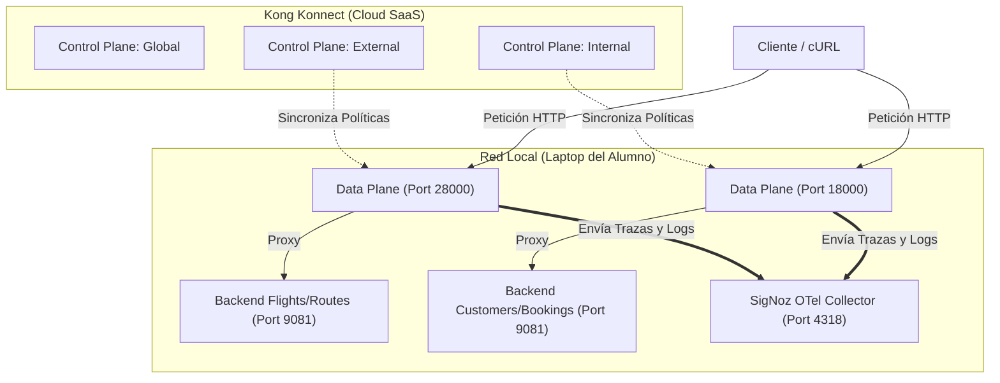

<div align="center">
  <h1>🚀 Kong API Gateway & Konnect</h1>
  <h2>Workshop Oficial: Ejercicio 001 (Versión Manual / UI)</h2>
  <br>
  <p><strong>Edición Configuración Manual desde Interfaz Gráfica & Observabilidad Avanzada (SigNoz)</strong></p>
  <p><em>Duración Estimada: 150 minutos</em></p>
  <br>
</div>

---

## 📑 Índice de Contenidos

- [Introducción](#introducción)
- [A. Pre-requisitos y convención de puertos (10 min)](#a-pre-requisitos-y-convención-de-puertos-10-min)
  - [A.1 Pre-requisitos mínimos](#a1-pre-requisitos-mínimos)
  - [A.2 Variables para comandos (Ajustadas a tu entorno local)](#a2-variables-para-comandos-ajustadas-a-tu-entorno-local)
- [B. Secuencia de ejercicios (140 min)](#b-secuencia-de-ejercicios-140-min)
  - [B.1 Preparación de Herramientas de Prueba (5 min)](#b1-preparación-de-herramientas-de-prueba-5-min)
  - [B.2 Gobierno: Creación manual de Control Planes (10 min)](#b2-gobierno-creación-manual-de-control-planes-10-min)
  - [B.3 Creación de Data Planes y Convención de Puertos (15 min)](#b3-creación-de-data-planes-y-convención-de-puertos-15-min)
  - [B.4 Observabilidad Global: Configuración manual en el Control Plane Global (10 min)](#b4-observabilidad-global-configuración-manual-en-el-control-plane-global-10-min)
  - [B.5 Gobierno: Teams y RBAC manual (10 min)](#b5-gobierno-teams-y-rbac-manual-10-min)
  - [B.6 Sincronización manual del estado base de APIs (20 min)](#b6-sincronización-manual-del-estado-base-de-apis-20-min)
  - [B.7 Control de exposición: matching por método HTTP (5 min)](#b7-control-de-exposición-matching-por-método-http-5-min)
  - [B.8 Seguridad: autenticación con Key Auth (15 min)](#b8-seguridad-autenticación-con-key-auth-15-min)
  - [B.9 Seguridad: autorización con ACL (15 min)](#b9-seguridad-autorización-con-acl-15-min)
  - [B.10 Control de tráfico: rate limiting diferenciado por Consumer (10 min)](#b10-control-de-tráfico-rate-limiting-diferenciado-por-consumer-10-min)
  - [B.11 Transformación: Response Transformer (5 min)](#b11-transformación-response-transformer-5-min)
  - [B.12 Transformación: Request Transformer (OPCIONAL) (10 min)](#b12-transformación-request-transformer-opcional-10-min)
  - [B.13 Trazabilidad: request/correlation identifier (5 min)](#b13-trazabilidad-requestcorrelation-identifier-5-min)
  - [B.14 Seguridad adicional: IP Restriction (5 min)](#b14-seguridad-adicional-ip-restriction-5-min)
  - [B.15 Observabilidad: Konnect Analytics Explorer (5 min)](#b15-observabilidad-konnect-analytics-explorer-5-min)

## Introducción

En este laboratorio integrador construiremos desde cero una plataforma API Gateway. A diferencia de la guía principal (que utiliza GitOps con Terraform y decK), **en esta versión realizaremos todas las configuraciones paso a paso de manera manual utilizando la interfaz web de Kong Konnect (UI)**. 

A lo largo del taller, emularemos un ecosistema distribuido donde:
- **Konnect (SaaS)** actuará como nuestro panel de control centralizado.
- **Data Planes Locales** procesarán el tráfico real, consumiendo APIs mock (vuelos, rutas, clientes, reservas).
- **SigNoz (OpenTelemetry)** funcionará como nuestro pilar de observabilidad unificada.

El siguiente diagrama detalla la arquitectura que implementaremos:



---

## Fase 0: Instalación de Prerrequisitos

Antes de iniciar el entorno local, asegúrate de tener instaladas las herramientas necesarias (Docker, jq, etc.). Hemos preparado un script automatizado para facilitar este proceso. Ejecuta el comando correspondiente a tu sistema operativo:

```text
# Para Mac/Linux
./scripts/install_prereqs_manual.sh

# Para Windows (CMD)
.\scripts\install_prereqs_manual.bat

# Para Windows (PowerShell)
.\scripts\install_prereqs_manual.ps1
```

> **Validación:** El script terminará imprimiendo las versiones de todas las herramientas instaladas. Verifica que no haya mensajes de error marcados en rojo.

---

## A. Pre-requisitos y convención de puertos (10 min)

### A.1 Pre-requisitos mínimos
1. Credenciales de acceso a la consola de Kong Konnect (`https://us.konghq.com/`).
2. Una cuenta y Token Personal (PAT - Personal Access Token) en Kong Konnect.
3. Repositorio del taller clonado: `ejercicio-001`.

### A.2 Variables para comandos (Ajustadas a tu entorno local)
A lo largo de esta guía, utilizaremos un prefijo identificador para que tus recursos no colisionen con los de otros compañeros. 
1. Abre tu terminal y configura la variable `PARTICIPANT_PREFIX` (usa tu nombre o alias, por ejemplo `rzengin`):

   **Para Mac/Linux:**
   ```text
   export PARTICIPANT_PREFIX="rzengin"
   export KONNECT_TOKEN="<TU_TOKEN_AQUI>"
   ```
   **Para Windows (CMD):**
   ```text
   set "PARTICIPANT_PREFIX=rzengin"
   set "KONNECT_TOKEN=<TU_TOKEN_AQUI>"
   ```
   **Para Windows (PowerShell):**
   ```text
   $env:PARTICIPANT_PREFIX="rzengin"
   $env:KONNECT_TOKEN="<TU_TOKEN_AQUI>"
   ```

---

## B. Secuencia de ejercicios (140 min)

### B.1 Preparación de Herramientas de Prueba (5 min)
**Objetivo:** validar que los backends locales de prueba (Mocks) están funcionando y preparar la recolección de métricas.

1. Navega a la carpeta del ejercicio: `cd ejercicio-001`
2. Levanta el stack local (Backend de pruebas Mockbin y Observabilidad SigNoz) utilizando los scripts provistos:

   **Para Mac/Linux:**
   ```text
   ./scripts/setup.sh
   ./scripts/setup-signoz.sh
   ```
   **Para Windows:**
   ```text
   .\scripts\setup.bat
   .\scripts\setup-signoz.bat
   ```
3. Verifica que los servicios mock respondan correctamente:
   `curl -i http://localhost:9081/anything/status` (debe devolver HTTP 200).

---

### B.2 Gobierno: Creación manual de Control Planes (10 min)
**Objetivo:** Crear los clústeres lógicos (Control Planes) para agrupar APIs de forma separada según su dominio de exposición.

1. Inicia sesión en **Kong Konnect** (`https://us.konghq.com`).
2. En el menú de la izquierda, haz clic en **Gateway Manager**.
3. Haz clic en el botón superior derecho **New Control Plane**.
   > 📸 **[CAPTURA DE PANTALLA REQUERIDA]** Toma captura de "Nuevo Control Plane" y guárdala como: `images/ui_new_cp.png`
4. Crea el Control Plane **External**:
   - **Name:** `<TU_PREFIX>_KongAir_External` (ej. `rzengin_KongAir_External`)
   - **Type:** `Kong Gateway`
   - Haz clic en **Create**.
5. Repite los pasos 3 y 4 para crear el Control Plane **Internal**:
   - **Name:** `<TU_PREFIX>_KongAir_Internal`
6. Repite los pasos 3 y 4 para crear el Control Plane **Global**:
   - **Name:** `<TU_PREFIX>_KongAir_Global`

---

### B.3 Creación de Data Planes y Convención de Puertos (15 min)
**Objetivo:** levantar los nodos de ejecución de Kong locales y conectarlos a tus Control Planes recién creados.

> [!TIP]
> **Vía Rápida Automatizada:** Si prefieres no realizar la configuración manual del Data Plane nodo por nodo, puedes usar el script de automatización.
> 
> **Para Mac/Linux:**
> ```text
> python3 scripts/generate_certs.py
> ./scripts/start_dps_signoz_net.sh
> ```
> 
> **Para Windows:**
> ```text
> python scripts/generate_certs.py
> .\scripts\start_dps_signoz_net.bat
> ```

Si ejecutas los scripts de la Vía Rápida, tus nodos aparecerán "In Sync" en Konnect y puedes saltar directamente al paso **B.4**.

---

### B.4 Observabilidad Global: Configuración manual en el Control Plane Global (10 min)
**Objetivo:** Habilitar el plugin de OpenTelemetry para capturar trazas, métricas y logs.

1. En la consola de Konnect, ve a **Gateway Manager** y selecciona tu Control Plane `<TU_PREFIX>_KongAir_External`.
2. En el menú lateral de ese Control Plane, selecciona **Plugins**.
3. Haz clic en **New Plugin**.
   > 📸 **[CAPTURA DE PANTALLA REQUERIDA]** Toma captura de "Nuevo Plugin" y guárdala como: `images/ui_new_plugin.png`
4. Busca `OpenTelemetry` y haz clic en él.
5. Configura los siguientes parámetros en la sección **Config**:
   - **Traces Endpoint:** `http://host.docker.internal:4318/v1/traces`
   - **Logs Endpoint:** `http://host.docker.internal:4318/v1/logs`
   - **Header Type:** `w3c`
   - En la subsección **Metrics**:
     - Endpoint: `http://host.docker.internal:4318/v1/metrics`
     - Enable Request Metrics: `True`
     - Enable Latency Metrics: `True`
     - Enable Bandwidth Metrics: `True`
   - En la subsección **Resource Attributes**, agrega los siguientes clave-valor:
     - `service.name` = `kong-api-gateway`
     - `deployment.environment` = `workshop`
6. Haz clic en **Save**.
7. **Repite este mismo proceso** para tu Control Plane `<TU_PREFIX>_KongAir_Internal`.

---

### B.5 Gobierno: Teams y RBAC manual (10 min)
**Objetivo:** demostrar delegación de administración y aislamiento de permisos.

1. Ve a **Organization -> Teams** en el menú principal izquierdo de Konnect.
2. Haz clic en **New Team**.
   > 📸 **[CAPTURA DE PANTALLA REQUERIDA]** Toma captura de "Nuevo Team" y guárdala como: `images/ui_new_team.png`
3. Crea el equipo para el dominio externo:
   - **Team Name:** `<TU_PREFIX> External Developers`
   - Haz clic en **Create**.
4. Ahora asociaremos los permisos a este equipo:
   - Ingresa al equipo recién creado y ve a la pestaña **Roles**.
   - Haz clic en **Add Roles**.
   - Selecciona **Control Plane Admin**.
   - En la lista desplegable de "Entity", selecciona tu Control Plane: `<TU_PREFIX>_KongAir_External`.
   - Haz clic en **Save**.
5. Repite el proceso para crear el equipo `<TU_PREFIX> Internal Developers` y asígnale el rol de Control Plane Admin **únicamente** sobre tu Control Plane `<TU_PREFIX>_KongAir_Internal`.

---

### B.6 Sincronización manual del estado base de APIs (20 min)
**Objetivo:** Crear los servicios base y sus rutas en la interfaz gráfica.

**Configurando el Control Plane External:**
1. Ve a **Gateway Manager -> `<TU_PREFIX>_KongAir_External` -> Services**.
2. Haz clic en **New Service**.
   > 📸 **[CAPTURA DE PANTALLA REQUERIDA]** Toma captura de "Nuevo Service" y guárdala como: `images/ui_new_service.png`
3. **Servicio Flights:**
   - **Name:** `flights`
   - **URL:** `http://host.docker.internal:9081/anything/flights`
   - Haz clic en **Save**.
4. Haz clic en el servicio `flights` que acabas de crear. Ve a la pestaña **Routes** dentro del servicio y haz clic en **New Route**.
5. **Ruta Flights:**
   - **Name:** `flights-route`
   - **Paths:** `/flights` (Presiona Enter para que se convierta en una burbuja azul).
   - Haz clic en **Save**.
6. **Repite el proceso** para crear el servicio `routes`:
   - Service Name: `routes` / URL: `http://host.docker.internal:9081/anything/routes`
   - Route Name: `routes-route` / Path: `/routes`

**Configurando el Control Plane Internal:**
7. Ve a **Gateway Manager -> `<TU_PREFIX>_KongAir_Internal` -> Services**.
8. Crea los siguientes dos servicios con sus respectivas rutas:
   - Service Name: `customers` / URL: `http://host.docker.internal:9081/anything/customers` / Route Path: `/customers`
   - Service Name: `bookings` / URL: `http://host.docker.internal:9081/anything/bookings` / Route Path: `/bookings`

**Validación:**
9. Ahora que las APIs existen en Konnect y están bajando a tu Data Plane, valida que puedes consumir las rutas:

   **Para Mac/Linux:**
   ```text
   curl -i http://localhost:28000/flights
   curl -i http://localhost:18000/customers
   ```

10. **Generación de Tráfico Masivo:** Para apreciar el valor del stack de observabilidad, generemos carga:
   **Para Mac/Linux:**
   ```text
   for i in {1..100}; do curl -s -o /dev/null http://localhost:28000/flights; done
   for i in {1..100}; do curl -s -o /dev/null http://localhost:28000/routes; done
   for i in {1..100}; do curl -s -o /dev/null http://localhost:18000/customers; done
   for i in {1..100}; do curl -s -o /dev/null http://localhost:18000/bookings; done
   ```
   **Para Windows:**
   ```text
   1..100 | ForEach-Object { curl.exe -s -o NUL http://localhost:28000/flights }
   1..100 | ForEach-Object { curl.exe -s -o NUL http://localhost:28000/routes }
   1..100 | ForEach-Object { curl.exe -s -o NUL http://localhost:18000/customers }
   1..100 | ForEach-Object { curl.exe -s -o NUL http://localhost:18000/bookings }
   ```

11. **Dashboards (Métricas):** Abre tu navegador e ingresa a SigNoz en `http://localhost:8080/dashboards`. Importa el archivo `kong-gateway.json` para visualizar el tráfico que acabas de generar.

---

### B.7 Control de exposición: matching por método HTTP (5 min)
**Objetivo:** reducir la superficie expuesta restringiendo los métodos en una Route.

1. Ve a **Gateway Manager -> `<TU_PREFIX>_KongAir_External` -> Routes**.
2. Haz clic en `flights-route`.
3. Haz clic en el botón **Edit** (esquina superior derecha).
   > 📸 **[CAPTURA DE PANTALLA REQUERIDA]** Toma captura de "Editar Ruta" y guárdala como: `images/ui_edit_route.png`
4. Busca el campo **Methods** y escribe `GET`. (Presiona Enter para crear la burbuja azul).
5. Haz clic en **Save**.
6. **Prueba:**
   ```text
   curl -i -X POST http://localhost:28000/flights
   ```
   Debe devolver HTTP `404 No Route Matched`.

---

### B.8 Seguridad: autenticación con Key Auth (15 min)
**Objetivo:** centralizar la autenticación en el Gateway.

1. Ve a **Gateway Manager -> `<TU_PREFIX>_KongAir_External` -> Services**.
2. Haz clic en `flights`.
3. Baja hasta la sección **Plugins** de este servicio y haz clic en **New Plugin**.
4. Busca y selecciona **Key Authentication**.
5. En **Key Names**, escribe `apikey` (y presiona Enter).
6. Haz clic en **Save**.
7. **Prueba rápida:** `curl -i http://localhost:28000/flights` ahora devolverá `401 Unauthorized`.

**Creación de Consumers:**
8. Ve a **Gateway Manager -> `<TU_PREFIX>_KongAir_External` -> Consumers**.
9. Haz clic en **New Consumer**.
   > 📸 **[CAPTURA DE PANTALLA REQUERIDA]** Toma captura de "Nuevo Consumer" y guárdala como: `images/ui_new_consumer.png`
10. **Username:** `App-External`. Haz clic en **Save**.
11. Ve a la pestaña **Credentials** de ese Consumer, selecciona **New Key Auth Credential**.
12. **Key:** `external-secret-123`. Haz clic en **Save**.
13. Repite los pasos 9 a 12 para crear el Consumer `App-Internal` con la llave `internal-secret-123`.
14. **Prueba Exitosa:** 
    ```text
    curl -i http://localhost:28000/flights -H "apikey: external-secret-123"
    ```
    Debe devolver `200 OK`.

---

### B.9 Seguridad: autorización con ACL (15 min)
**Objetivo:** restringir acceso declarando grupos ACL.

1. Ve a **Gateway Manager -> `<TU_PREFIX>_KongAir_External` -> Services**.
2. Selecciona `flights` y añade un nuevo plugin: **ACL**.
3. En la configuración de ACL, bajo **Allow**, escribe `external` (y presiona Enter).
4. Haz clic en **Save**.

**Asignar Grupos a Consumers:**
5. Ve a **Consumers -> `App-External`**.
6. Ve a la pestaña **Credentials** -> **New ACL Credential**.
   > 📸 **[CAPTURA DE PANTALLA REQUERIDA]** Toma captura de "Nueva ACL Credential" y guárdala como: `images/ui_new_acl.png`
7. En **Group**, escribe `external`. Guarda.
8. Ve a **Consumers -> `App-Internal`** y añádele una credencial ACL con el grupo `internal`.
9. **Prueba:**
   ```text
   curl -i http://localhost:28000/flights -H "apikey: internal-secret-123"
   ```
   Ahora devolverá `403 Forbidden` porque el usuario interno no pertenece al grupo `external`.

---

### B.10 Control de tráfico: rate limiting diferenciado por Consumer (10 min)
**Objetivo:** aplicar límites distintos por perfil de consumo.

1. Ve a **Consumers -> `App-External`**.
2. Selecciona la pestaña **Plugins** de ese Consumer y haz clic en **New Plugin**.
3. Selecciona **Rate Limiting**.
4. Configura **Config.Minute:** `3` y **Config.Limit By:** `consumer`.
5. Guarda los cambios.
6. **Repite para App-Internal:** Agrégale el plugin Rate Limiting al Consumer `App-Internal`, pero configúralo en `5` peticiones por minuto.
7. **Validación:**
   Genera tráfico continuo con la llave de App-External hasta recibir un HTTP `429 Too Many Requests`.

---

### B.11 Transformación: Response Transformer (5 min)
**Objetivo:** Mutar la respuesta inyectando cabeceras corporativas.

1. Ve a **Routes -> `flights-route`** en el CP External.
2. Añade un **New Plugin** a la ruta: selecciona **Response Transformer**.
3. En la sección **Add.Headers**, escribe: `X-Kong-Response:Workshop` (presiona Enter).
4. Haz clic en **Save**.
5. Realiza un llamado cURL con `curl -i` para observar que la cabecera ha sido insertada.

---

### B.12 Transformación: Request Transformer (OPCIONAL) (10 min)
**Objetivo:** Mutar la petición antes de enviarla al backend.

1. Ve a **Services -> `flights`**.
2. En la URL del servicio, cámbiala temporalmente para que apunte a `http://host.docker.internal:9081/anything/get`.
3. Ve a **Routes -> `flights-route`** y añádele el plugin **Request Transformer**.
4. En **Add.Headers**, añade `X-Injected-By:Kong`.
5. En **Add.Querystring**, añade `source:konnect`.
6. Guarda y realiza un request. Observarás en el body JSON (que el mock backend nos devuelve) que Kong inyectó estos parámetros.

---

### B.13 Trazabilidad: request/correlation identifier (5 min)
**Objetivo:** rastreo distribuido de peticiones inyectando un UUID.

1. Ve al menú lateral **Plugins** (A nivel del Control Plane External).
2. Haz clic en **New Plugin** y busca **Correlation ID**.
3. En **Header Name**, escribe `X-Request-ID`.
4. En **Generator**, selecciona `uuid`.
5. Haz clic en **Save**.
6. Realiza un cURL al servicio `/flights` y observarás que Kong incluye la cabecera `X-Request-ID`.

---

### B.14 Seguridad adicional: IP Restriction (5 min)
**Objetivo:** Control de acceso en la capa de red (L4).

1. Ve a **Routes -> `flights-route`**.
2. Añade un **New Plugin** y selecciona **IP Restriction**.
3. En la sección **Deny**, escribe `127.0.0.1` (o la IP de la que provienen tus peticiones locales si utilizas un balanceador/docker gateway, comúnmente `172.18.0.1` u otro IP del host en Docker).
4. Guarda y haz un curl local. Recibirás un error `403 Forbidden` indicando "Your IP address is not allowed".

---

### B.15 Observabilidad: Konnect Analytics Explorer (5 min)
**Objetivo:** visualizar métricas nativas en SaaS.

1. En **Konnect**, en el menú izquierdo principal, haz clic en **Analytics**.
2. Ve al **Overview** y filtra por tu Control Plane `KongAir_External`.
3. Verás gráficos con todos los accesos que hemos realizado durante el taller (Status codes, latencias y peticiones rechazadas por Rate Limiting y ACL).
